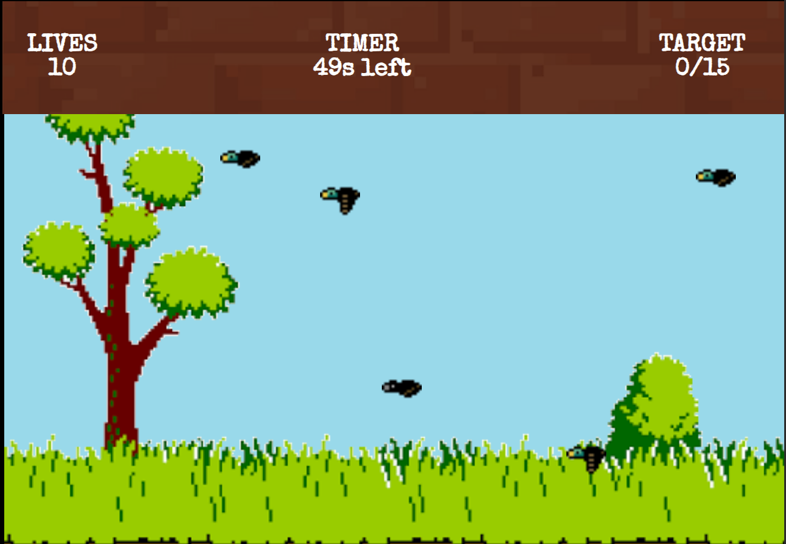
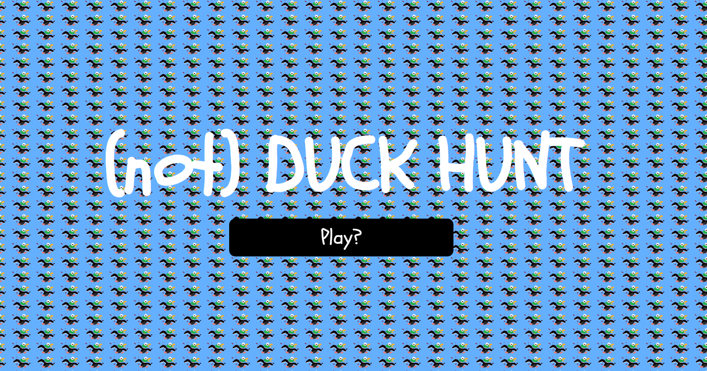
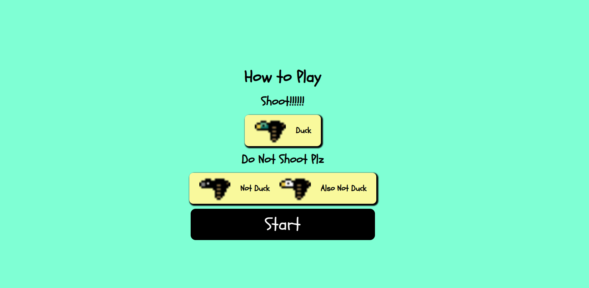

# Duck Hunt

A simple browser-based Duck Hunt clone built with HTML, CSS, and JavaScript.

## User Stories
* As a User, i want to shoot ducks
* As a User, i want to be challenged by a timer
* As a User, i want to be challenged by bird movement
* As a User, i want a win condition i need to acheieve

## Features

- Flying ducks
- Score tracking
- Timer Based
- Movement Speed Increases through time
- Click the ducks to score points
- Clicking Crow or Eagle will cause penalties

## Technologies

- HTML
- CSS
- JavaScript

## How to Play

1. Click **Start Game**.
2. Aim using the crosshair.
3. Click on ducks to earn points.
4. *Shooting* a non-Duck bird **reduces** the lives or time.
5. Score as many points as the target to beat the level

## Basic Design (Pre-Development)

## Attributions

[Home Page and Icon from The Spriters Resource](https://www.spriters-resource.com/nes/duckhunt/asset/13056/)

[Duck Sprite from Open Game Art](https://opengameart.org/content/16x16-duck?utm_source=chatgpt.com). (Eagle and Crow Variations were created with coolor switch on this sprite)

[Game Music/Sounds from Mixkit](https://mixkit.co)
## Final Game

### Ingame Screenshots

#### Gameplay

#### Home Page

#### How to Play

## Future Enhancement

* Usage of Canvas to draw the game onto the browser
* Additional Birds
* Added Difficulty Choices
* Themes

##  Link to Play
[Duck Hunt](https://mohammed-m8.github.io/duck-hunt-browser-game/)

