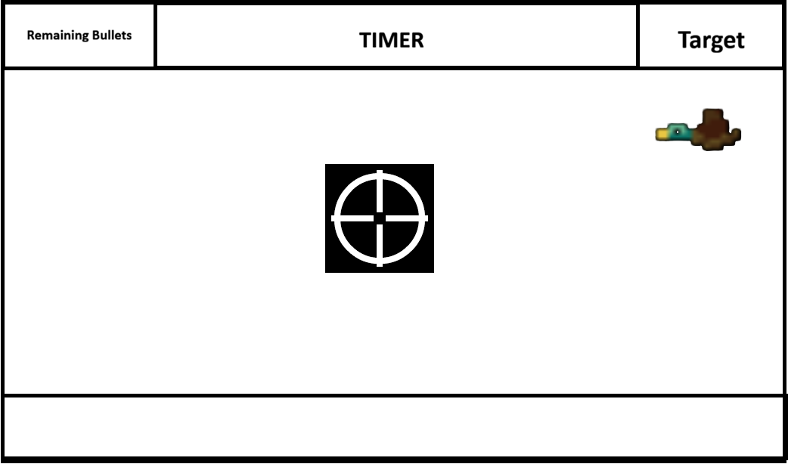

# Duck Hunt

A simple browser-based Duck Hunt clone built with HTML, CSS, and JavaScript.

## User Stories
* As a User, i want to shoot ducks
* As a User, i want to be challenged by a timer
* As a User, i want to be challenged by bird movement
* As a User, i want a win condition i need to acheieve

## Features

- Flying ducks (possibly animated)
- Score tracking
- Timer Based
- Ducks spawn faster after each miss
- Click the ducks to score points

## Technologies

- HTML
- CSS
- JavaScript

## How to Play

1. Click **Start Game**.
2. Aim using the crosshair.
3. Click on ducks to earn points.
4. *Missing* a shot **increases** the duck spawn rate.
5. Score as many points as possible to beat the level

## Basic Design

## Final Game
[Duck Hunt](https://mohammed-m8.github.io/duck-hunt-browser-game/)

